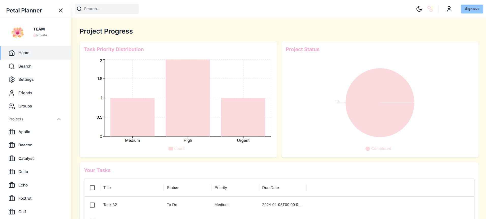

## Petal Planner

**Petal Planner** is a full-stack task and project management application designed to help individuals and teams organize, manage, and track their tasks and projects in a simple yet efficient way. The application allows users to create and manage projects, tasks, and track progress in an intuitive interface.

## Technology Stack

Built using **Next.js**, **Node.js**, **React**, **TypeScript**, **Tailwind CSS**, and a **PostgreSQL** database, Petal Planner is fully deployed on AWS using **Cognito** for authentication, **EC2** for hosting, and **RDS** for database management.

- **Frontend**: Next.js, Tailwind CSS, Redux Toolkit, Redux Toolkit Query, Material UI Data Grid
- **Backend**: Node.js with Express, Prisma (PostgreSQL ORM)
- **Database**: PostgreSQL, managed with PgAdmin
- **Cloud**: AWS EC2, AWS RDS, AWS API Gateway, AWS Amplify, AWS S3, AWS Lambda, AWS Cognito

---

## Features

- **User Authentication**: Secure login and registration using **AWS Cognito**.
- **Task Management**: Users can create, update, and track tasks within projects.
- **Project Management**: Organize tasks into projects, view progress, and manage deadlines.
- **Responsive Design**: Mobile-first approach using **Tailwind CSS**.
- **Real-time Updates**: Keep track of project and task status in real time.
- **Scalable Database**: Utilizes **PostgreSQL** via **AWS RDS** for data storage.
- **Cloud Hosting**: Fully deployed on AWS with **EC2** instances for hosting.

---

## Setup Instructions

To run Petal Planner locally or deploy it yourself, follow the instructions below:

### Prerequisites

1. **Node.js** (version 16 or above)
2. **npm** (or **yarn**) installed
3. **PostgreSQL** database (for local development if not using AWS RDS)
4. **AWS Account** (for deploying the app on AWS)
5. **AWS CLI** (optional, for managing AWS resources from the terminal)
   
---

## Usage

1. **Create Account & Log In**: Use the registration page to create an account. You can log in via AWS Cognito authentication.
2. **Create a Project**: After logging in, you can create a new project by providing a title, description, and setting a deadline.
3. **Add Tasks**: Within each project, you can add tasks with specific details like task title, description, and due date.
4. **Track Progress**: Users can mark tasks as completed, update task statuses, and track project progress.
5. **Responsive Design**: The app is designed to be responsive, making it easy to use across devices.

---
